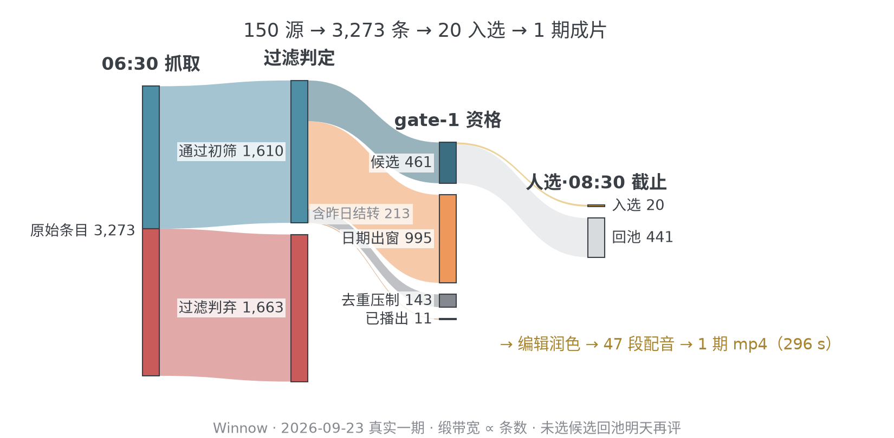
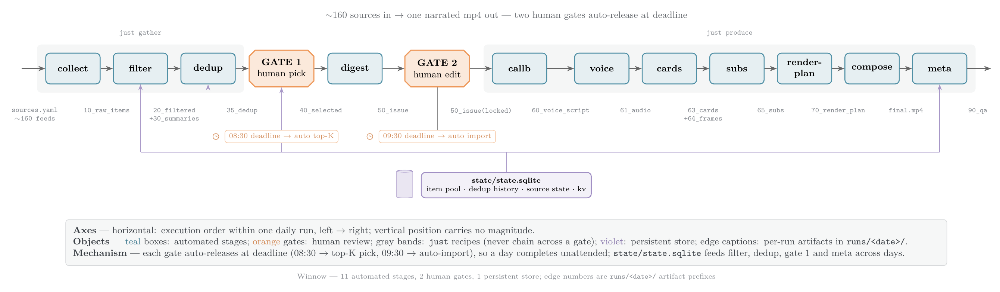
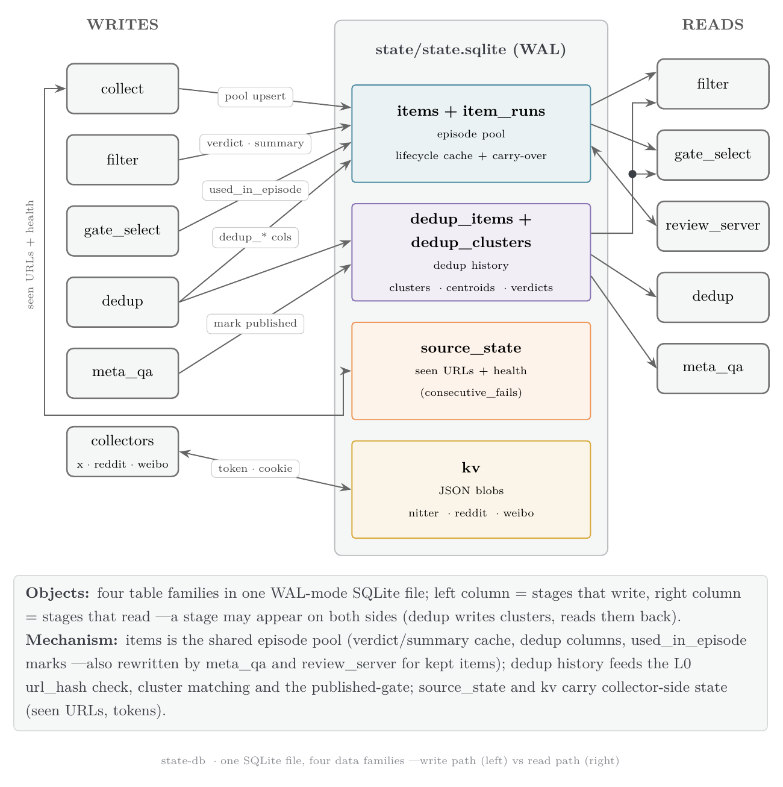
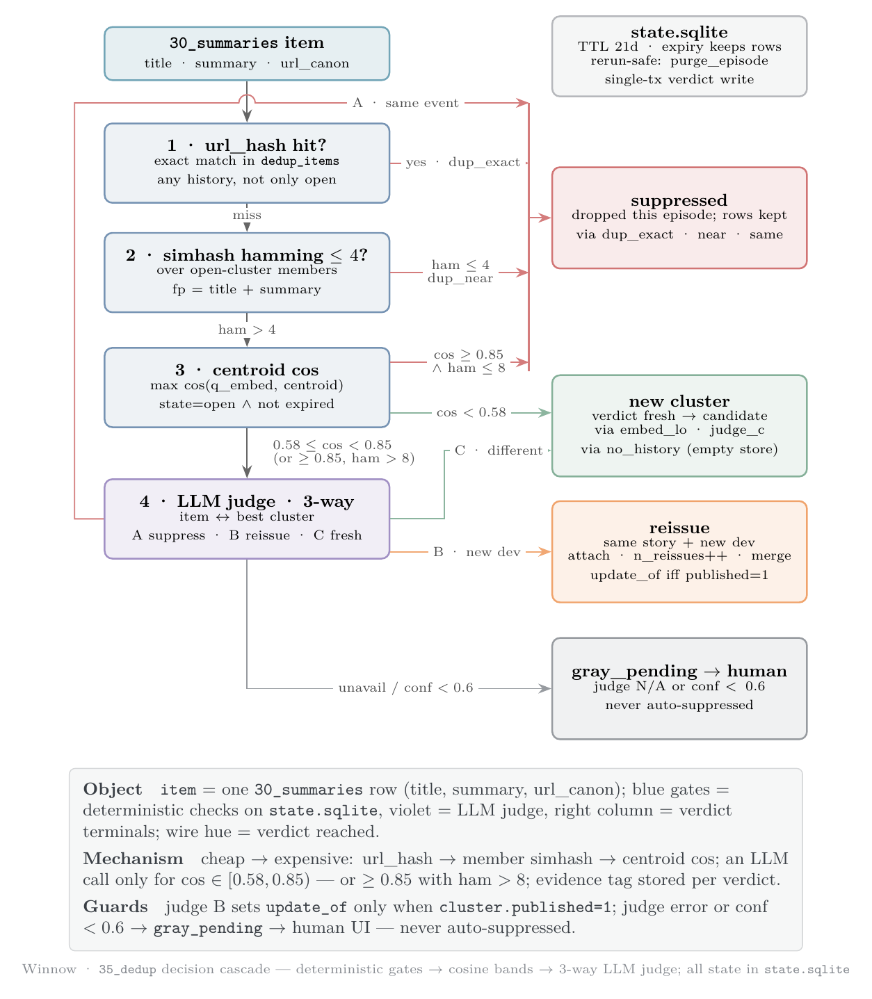

# Winnow

> **风选** —— 风一吹，糠秕走，籽粒留。约 160 个信息源进，一条成片 mp4 出。

> 中文快照（2026-09-24）；最新以英文 README.md 为准。


每日《AI 早报》生产线：每天清晨从约 160 个信息源收流，经已校准的级联去重 + LLM 筛选（LLM judge 只在灰区出手），在两道人工闸前停一停——手机上选稿、改稿都行，死线到点未动则按 news_value 自动放行 top-K；随后合成配音、卡片、字幕、封面，产出可直接投稿的 mp4（含标题与 QA）。

- **两道人工闸、两条死线**——想管时是真正的编辑权，不管时 systemd timer 自动出片；
- **每个 artifact 都是契约**——12 个阶段读写 pydantic 校验过的 JSON，runs 可续跑（`just resume`）、可回放、可审计；
- **单文件状态库**——`state/state.sqlite` 一个 WAL 文件装下跨期条目池、去重历史、源健康与 kv；
- **全链路离线测试**——`just test` 自测套件 + golden-run fixture 守住每次提交，无需联网。



全部经 justfile 驱动。设计/实施唯一真源是 `docs/PLAN.md`；部署与服务配置见 `docs/deploy.md`。

## Pipeline 概览



```
collect      sources.yaml 161 源 → 原始抓取
filter       L0 规则 + LLM verdict/summary（state/state.sqlite 条目池跨期缓存）
dedup        同日聚类 + 跨天级联去重（state/state.sqlite dedup_* 表）
── gate 1 人工选稿 ──────────────────────────────────────────────
  just pick 起 review_server（0.0.0.0:8923，一次性 token URL ?t=…，手机可开）
  死线 08:30 未提交 → pick-auto 按 news_value 取 top-K
digest       Call A：选稿 → 50_issue.json + 50_review.md
── gate 2 人工编辑 ──────────────────────────────────────────────
  just edit 改 50_review.md → just edit-import 回灌再校验
  死线 09:30 自动 import 未提交的编辑（sha 漂移探测）
callb        Call B：投影 voice/cards/video.shot_sentences + 合规 pass
voice        TTS 逐句合成 → 音频 + 时间轴
cards        upstream/juya-news-card 模板渲染 + 来源网页截图叠加卡
subs         字幕 pill PNG（ffmpeg 合成路径用）
render-plan  70_render_plan.json（绝对时间轴，ffmpeg/Remotion 共用）
compose      ffmpeg → out/final.mp4（composer/ Remotion 为备选引擎）
meta         标题/封面/QA → 90_qa.json
```

驱动是 justfile（~40 配方）：`gather` `pick` `produce` `status` `watch` `tail` `from` `resume` `exp` `doctor` `test` 等。配方不跨人工闸串链； `runs/<date>/.just.lock` 串行化同一日期桶的 just 调用。 `ops/*.timer`（systemd）：06:30 collect、08:30 gate-1 死线、09:30 gate-2 死线 —— 无人值守时全自动放行出片。

每期状态：`state/state.sqlite`（跨期单库：条目池 + 去重历史 + 源状态 + kv）+ `runs/YYYY-MM-DD/` （当日全量 artifact + logs/ + 00_meta.json 阶段簿记）。



去重对每条走一串已校准的级联判定——url_hash 精确命中 → simhash 海明距 → embed cos 分段 → 只有灰区才调 LLM judge：



## Quickstart

依赖：python ≥3.11、uv、node/npm、just、flock、ffmpeg（libx264）。chromium、node_modules、lychee 由 setup-toolchain 补齐。

```bash
cp secrets.env.example secrets.env    # 填 SWE2MAX_API_KEY（本地 LLM 网关）
cp config.example.yaml config.yaml    # 按需改 alerts/proxy/schedule

just setup-toolchain   # 一次性：工具检查 + 目录 + npm install + playwright
just fetch-embed       # 拉 Qwen3-Embedding-0.6B-ONNX 到 ~/.cache/embed（dedup 必需，embed.py 不自动下载）
just setup-breeze      # Breeze TTS worker（clone + venvs/breeze；本机生产默认引擎，留 edge 可跳过）
just doctor            # 联网冒烟全组件（LLM/卡片/TTS/proxy/告警）

just gather            # collect → filter → dedup
just pick              # 起选稿 UI；用终端打印的 http://<ip>:8923/?t=… 打开
                       # （无 token 一律 403），勾选提交即写 40_selected.json
just produce           # digest → callb → voice → cards → subs → render-plan
                       # → compose → meta → runs/<date>/out/final.mp4
```

要走 gate-2 编辑：pick 之后先 `just digest` 出 50_review.md，`just edit` 改完 `just edit-import`，再 `just produce`（50_issue.json 已存在时自动跳过 Call A，编辑不丢）。完全不管也行：死线到点 timer 自动放行。

- 跑别的日期桶：`just DATE=2026-09-20 gather`
- 断了续跑：`just resume`（按 00_meta.json 校验补跑缺失阶段）
- 强制重跑某段：`just from <stage>`（跑到所属 block 末尾）
- 盯进度：`just status` / `just watch` / `just tail [stage]`
- 沙箱实验：`just exp <name> <stage> [args]`（runs/\_exp-\<name\>）
- 离线回归：`just test`

## 目录结构

```
stages/            12 个阶段脚本（uv 项目；uv run stages/xx.py --run-dir …）
stages/lib/        公共库：http / store / pool / embed / simhash / prompts /
                   shotlib / prog / meta / normalize / ttsnorm / *_collect …
                   + fixtures/ 自测样本 + seeds/（x_nitter 实例池种子）
contracts/         artifact pydantic 模型 + JSON schemas
contracts/fixtures/2026-09-20/   golden run fixture（validate + compose 自测用）
adapters/          LLM 网关、edge-tts、ntfy/deadman 告警、X 付费适配
assets/fonts/      SmileySans-Oblique.ttf（chrome 叠加卡标题字）
tools/watch.py     status / watch 仪表盘
ops/               prelude.sh（_jlock）+ systemd service/timer + install.sh
docs/              全部项目文档——索引见 docs/README.md
sources.yaml       161 源（method/tier/proxy/SLA；just lint-sources 校验）
config.yaml        本机配置（不入库；模板 config.example.yaml）
secrets.env        本机密钥（不入库；模板 secrets.env.example）
state/             state.sqlite（条目池+去重历史+源状态+kv 单库）+ backups/
runs/<date>/       每期全量 artifact（NN_*.json*）+ logs/
upstream/          vendored juya-news-card 卡片渲染器（docs/vendored-upstream.md）
composer/          Remotion 合成器（备选引擎，docs/composer.md）
```

## 文档地图

文档全部收在 `docs/`（索引：`docs/README.md`）。

| 文件 | 内容 |
| --- | --- |
| `docs/PLAN.md` | **设计/实施唯一真源**：D1–D12 已拍板决策、各阶段详设、验收口径 |
| `docs/deploy.md` | 部署指南：前置依赖、外部服务配置（LLM/TTS/告警/代理）、systemd timer、首跑 checklist |
| `rulebook.md` | filter/digest 筛选规则手册——留在根目录：stages 运行时直接读它 |
| `docs/CONTRIBUTING.md` | 工程约定：uv 项目形态、just 驱动、测试矩阵 |
| `docs/ops.md` | systemd user timer 部署 + prelude.sh/\_jlock 公共前奏 |
| `docs/vendored-upstream.md` | juya-news-card 定格 SHA、本地 patch 清单、重新同步上游方法 |
| `docs/composer.md` | Remotion 合成器用法（plan 输入优先级、字幕 live-text 约定）+ 可行性实验记录 |

## 调研背景

本仓库起点是对 UP 主 橘鸦 Juya《AI 早报》日更视频生产线（BV1NqeY6dEPP，2026-09-20 期）的调研与完整复刻；现仓库即其产线化形态。背后的调研档案——拆解证据（`evidence/`）、单期静态复刻（`repro/`）、选型/可行性实验（`experiments/`）——留存私仓、**不随仓发布**：`docs/PLAN.md` 里各处"种子：`experiments/…`"是出处标注，公开 clone 中这些路径不存在。

- `upstream/juya-news-card` —— UP 主开源卡片渲染器真身（MIT fork `Mappedinfo/juya-news-card`；原 imjuya 仓库已删号）。Next.js+React+TS，174 套模板；现由 cards 阶段经 `scripts/render-batch.ts` 批渲染调用。

环节归属（复刻口径）：内容卡片为纯上游实现（`generateTemplateHtml` + `claudeStyle` 模板逐像素渲染）；导航/面包屑叠加层、截图弹卡、字幕 pill、TTS 逐句对轨、ffmpeg 合成器为自造（原版必有对应物但未开源）；复刻期内容数据手写结构化（取自 UP 主当日 RSS），产线化后由 collect/filter/digest 的 LLM 环节取代。
