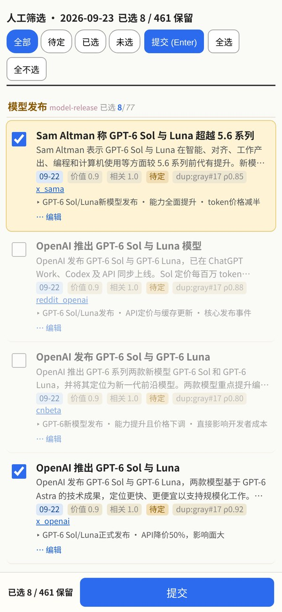

# deploy — 部署与服务配置

Winnow 跑在**一台常开 Linux 机器**上（systemd user timer 驱动，无容器）：每天 06:30 自动开跑，09:30 之后成片落盘。GPU 是可选件——只有本地 TTS 引擎（breeze）需要。本文把「装什么、配哪些外部服务、怎么挂定时、首跑验收」串成一条线；工程细节各归 `docs/ops.md`（unit 机制）与 `docs/PLAN.md`（设计真源）。

## 每日时间线

```
06:30  winnow-collect.timer → just gather       collect → filter → dedup
       …gate-1 人工窗口：just pick 起手机选稿页（0.0.0.0:8923, 一次性 token）
08:30  winnow-gate1.timer   → just deadline1    无人选稿则按 news_value 自动 top-K → digest
       …gate-2 人工窗口：just edit 改 50_review.md → just edit-import
09:30  winnow-gate2.timer   → just deadline2    锁定稿件 → callb → voice → cards
                                              → subs → render-plan → compose → meta
```

三个 timer 全 `Persistent=true`——关机错过时点开机后补跑；deadline 语义幂等，补跑安全。全程无人值守也成立：两道闸死线到点自动放行，定时出片。

gate-1 选稿页长这样（局域网手机打开，LLM 已预勾推荐、人工只需删减到上限内）：



## 前置依赖

系统层：Linux + systemd user manager、python ≥3.11、uv、node/npm、just、flock、ffmpeg（含 libx264）、git。`just setup-toolchain` 会逐项检查并补齐缺口：playwright chromium、`upstream/juya-news-card` 与 `composer/` 的 node_modules、lychee → `adapters/bin/`。

可选硬件：NVIDIA GPU（约 8GB 空闲显存）——仅 `tts.engine: breeze` 本地克隆引擎需要；默认 `edge` 引擎纯 CPU 即可。

## 要配置的服务

两份本地文件都不入库：`secrets.env`（密钥；模板 `secrets.env.example`）、`config.yaml`（配置；模板 `config.example.yaml`）。

| 服务 | 配置位置 | 不配的后果 |
| --- | --- | --- |
| **LLM endpoint（必需）** | `secrets.env` `SWE2MAX_API_KEY` + `config.yaml` `llm.base_url` / `llm.model` | filter/digest/callb 三个 LLM 阶段无法跑——硬依赖 |
| 备用 LLM 通道 | `secrets.env` `SWE2MAX_BG_API_KEY`（bg 窗口额度通道） | 不设则一律走默认 key |
| **TTS 引擎（二选一）** | `config.yaml` `tts.engine`：`edge` 在线零依赖 / `breeze` 本地克隆 | edge 开箱即用；breeze 需 `just setup-breeze` + GPU |
| 推送告警 | `config.yaml` `alerts.ntfy_url`（+ `ntfy_token` 受保护 topic） | 阶段告警只进日志，不发推送 |
| 死人开关 | `config.yaml` `alerts.deadman_ping_url`（healthchecks.io ping URL） | 整天没跑起来时无人察觉——建议配 |
| 出口代理 | `config.yaml` `proxy.http`（或 `*_proxy` env） | 需代理的源直连失败/降级 |
| X 源 | `x_collector.nitter_instances` 实例池 / `secrets.env` `X_PAID_KEY` 付费适配 | X 类源全灭，其余源不受影响 |
| 微博兜底 | `secrets.env` `WEIBO_COOKIES` | 微博源在 visitor mint 全失败时无保底 |

LLM 端点任意 OpenAI 兼容服务均可（`POST /chat/completions`）：本地网关、云 API、自架推理都行，model/temperature/batch_size 在 `llm.*` 调。

Breeze TTS 许可注意：`BreezeBlue/Breeze-TTS-2` 权重为**非商用研究协议**，权重永不入库（`setup-breeze` 拉到本机 HF cache）；商用场景请留在 `tts.engine: edge`。

## 安装序列

```bash
git clone <repo> && cd winnow
cp secrets.env.example secrets.env   # 填 SWE2MAX_API_KEY
cp config.example.yaml config.yaml   # 按上表改 llm/tts/alerts/proxy

just setup-toolchain   # 工具检查 + 目录 + node_modules + playwright chromium + lychee
just fetch-embed       # Qwen3-Embedding-0.6B-ONNX → ~/.cache/embed（dedup 硬依赖，不自动下载）
just setup-breeze      # 仅 engine=breeze：clone 推理代码 + venvs/breeze（torch 与 stage 进程隔离）
just doctor            # 联网冒烟：LLM ping / 卡片渲染 / edge-tts / playwright / embed / 代理 / 告警
```

`just doctor` 全 PASS 即具备首跑条件；FAIL 项的日志在 `runs/_doctor/` 下逐条可查。

## 挂 systemd timers

```bash
sudo loginctl enable-linger "$USER"   # 登出后 timer 仍会触发
bash ops/install.sh                   # 渲染 .service 模板 → ~/.config/systemd/user/ → enable --now
systemctl --user list-timers 'winnow-*'
```

`install.sh` 把 `__REPO__`/`__HOME__` 占位符 sed 成本机路径，仓库克隆在任意目录都能装。改时点：编辑 `ops/winnow-*.timer` 的 `OnCalendar` 后重跑 install.sh；gate-1 死线同时受 `config.yaml` `schedule.gate1_deadline` 控制（deadline-check 据此判断"过点没"），两处保持一致。unit 约定细节见 `docs/ops.md`。

## 首跑 checklist

建议先手动走通一遍再交给 timer：

```bash
just gather          # collect（161 源）→ filter(LLM) → dedup，耗时数十分钟
just pick            # 起 http://<ip>:8923/?t=… 手机勾选提交；不选也行
just digest          # Call A → 50_issue.json + 50_review.md
just edit            # 可选：改 50_review.md 后 just edit-import
just produce         # callb → voice → cards → subs → render-plan → compose → meta
```

验收：`runs/<当天>/out/final.mp4` 存在、`90_qa.json` 无 hard-fail、`just status` 全绿。中断续跑 `just resume`（按 `00_meta.json` 簿记补缺），实时日志 `just tail <stage>`，全部日志在 `runs/<date>/logs/`。

## 维护与排障

日常维护：`just backup-state`（state.sqlite `.backup` → `state/backups/`，保留 14 份）、`just gc-cache`（raw_cache 按 mtime 清 >7d）、`just pool-vacuum`（清 90d 未判条目 + VACUUM）、`just lint-sources`（sources.yaml 校验 + 可达性抽查）。

| 症状 | 看哪 |
| --- | --- |
| timer 没触发 | `systemctl --user list-timers`；`journalctl --user -u winnow-collect.service -u winnow-gate1.service -u winnow-gate2.service` |
| 某阶段挂了 | `runs/<date>/logs/<stage>.log` + `just status` 红绿灯；修完 `just from <stage>` 或 `just resume` |
| LLM 全灭 | `just doctor` 的 llm ping 段：base_url / key env / model 名 |
| 选稿页打不开 | 局域网放行 8923；URL 里 `?t=` 一次性 token 不能丢，丢了重启 `just pick` |
| 源大量失败 | `just lint-sources`；源健康分在 state.sqlite `source_state` 表 |
